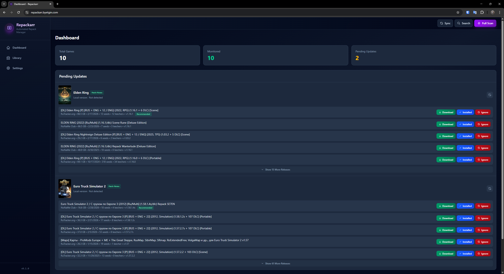
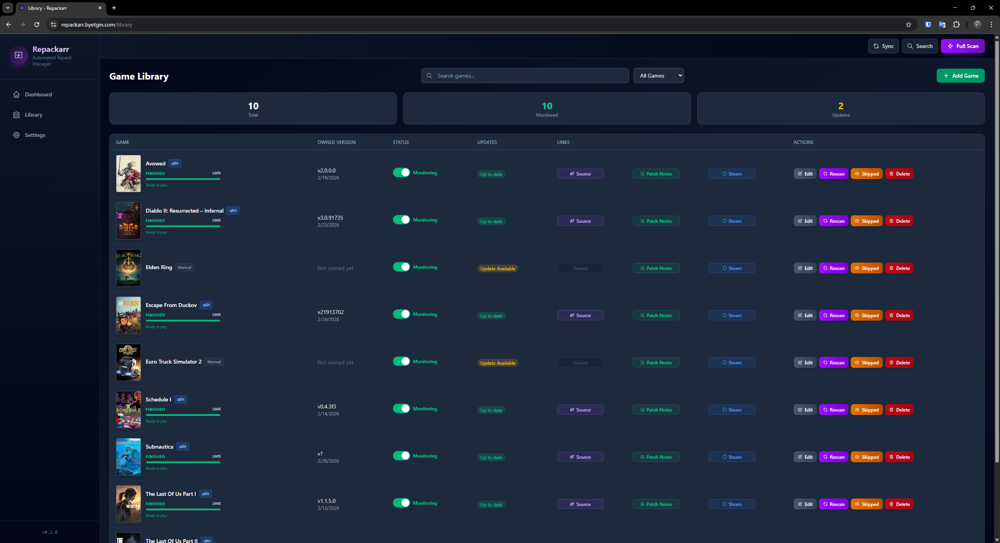
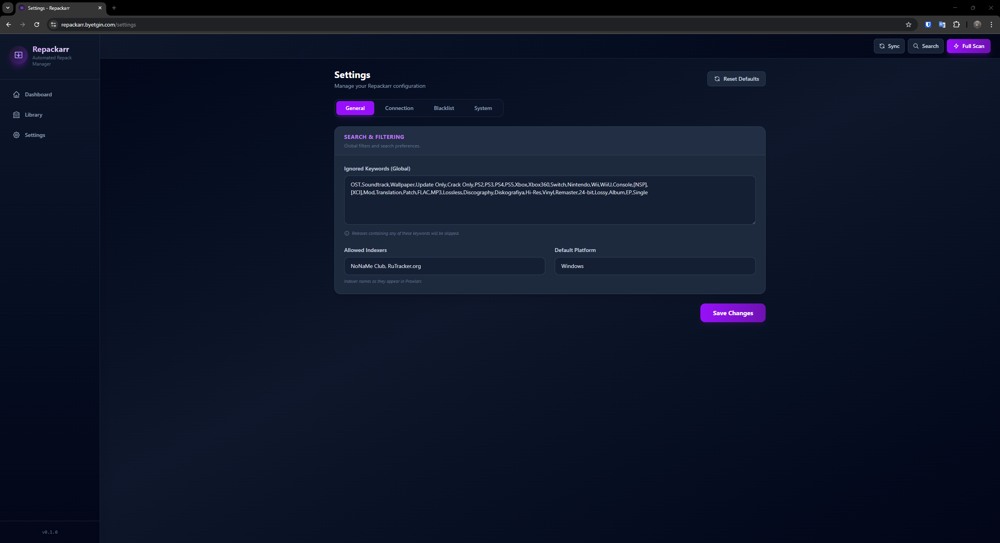

# Repackarr

**Repackarr** is an automated manager for game repacks. It monitors your existing qBittorrent library, tracks updates through Prowlarr, and allows you to upgrade your games with a single click. Think of it as "Sonarr/Radarr" specifically tailored for the game repack community.

## Screenshots

### Dashboard


### Library


### Settings


## Key Features

- **Automatic Library Sync**: Automatically imports games from your qBittorrent "games" category. No manual entry needed for existing collections.
- **Smart Version Detection**: Sophisticated parsing of torrent names to extract versions (v1.2, Build 1234, Update 5) and repackers (FitGirl, ElAmigos, etc.).
- **Prowlarr Integration**: Periodically scans your favorite trackers for newer releases of your monitored games.
- **Advanced Filtering**:
  - **Content Filtering**: Automatically ignores mods, patches, artbooks, and soundtracks.
  - **Platform Rules**: Filter by Windows, Linux, or macOS.
  - **Keyword Blacklist**: Globally ignore releases containing specific words (e.g., "OST", "Beta").
- **Rich Metadata**: Automatically fetches high-quality game covers and Steam links via IGDB integration.
- **One-Click Updates**: Send the magnet directly to qBittorrent with one button when a newer version is found.
- **Management Actions**:
  - **Skip**: Skip the current version but keep monitoring for future ones.
  - **Ignore**: Completely hide a specific release from your dashboard.
  - **Manual Add**: Track games that aren't in your library yet.

## Getting Started (Docker)

The easiest way to run Repackarr is via Docker Compose.

### Prerequisites (Prowlarr Setup)
Repackarr is optimized for the naming conventions of specific trackers. For the best experience, ensure the following indexers are configured in your Prowlarr:
- RuTracker.org
- NoNaMe Club (NNM-Club)

*Note: Without these indexers, Repackarr may fail to find updates or parse versions correctly.*

### 1. Create Directory Structure
```bash
mkdir repackarr && cd repackarr
mkdir data logs
```

### 2. Prepare Environment
Copy `.env.example` to `.env` and fill in your connection details:
```bash
# qBittorrent (Required)
QBIT_HOST=http://192.168.1.100:8080
QBIT_USERNAME=admin
QBIT_PASSWORD=adminadmin

# Prowlarr (Required)
PROWLARR_URL=http://192.168.1.100:9696
PROWLARR_API_KEY=your_api_key_here
```

### 3. Docker Compose
Create a `docker-compose.yml`:
```yaml
services:
  repackarr:
    image: ghcr.io/yakrel/repackarr:latest
    container_name: repackarr
    restart: unless-stopped
    ports:
      - "8090:3000"
    env_file: .env
    volumes:
      - ./data:/app/data
      - ./logs:/app/logs
    healthcheck:
      test: ["CMD", "curl", "-f", "http://localhost:3000/health"]
      interval: 30s
      timeout: 10s
      retries: 3
```

### 4. Launch
```bash
docker compose up -d
```
Access the dashboard at `http://your-ip:8090`.

## Configuration Options

| Environment Variable | Default | Description |
|---|---|---|
| `QBIT_CATEGORY` | `games` | The category in qBit to monitor |
| `CRON_INTERVAL_MINUTES` | `360` | Frequency of update checks |
| `AUTH_USERNAME/PASSWORD`| (None) | Set to enable Basic Auth for UI |
| `IGDB_CLIENT_ID/SECRET` | (None) | Optional: Enables game covers & metadata |
| `PLATFORM_FILTER` | `Windows` | Default platforms to search for |
| `ALLOWED_INDEXERS` | (All) | Comma-separated list of indexer names to use |

## Tech Stack

- **Frontend/Backend**: SvelteKit
- **Database**: SQLite with Drizzle ORM
- **Styling**: Tailwind CSS v4

## License

MIT License. See [LICENSE](LICENSE) for more information.

---
*Disclaimer: Repackarr is a tool for managing your own library. Please support game developers whenever possible.*
