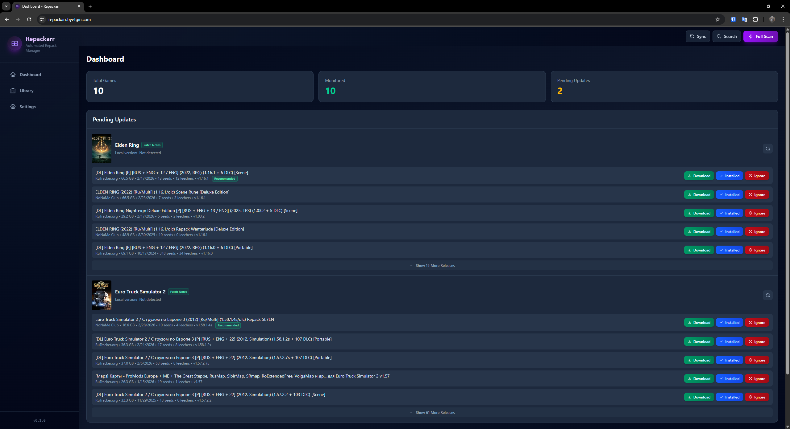
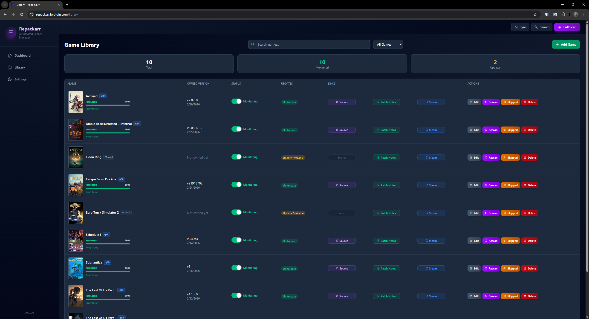
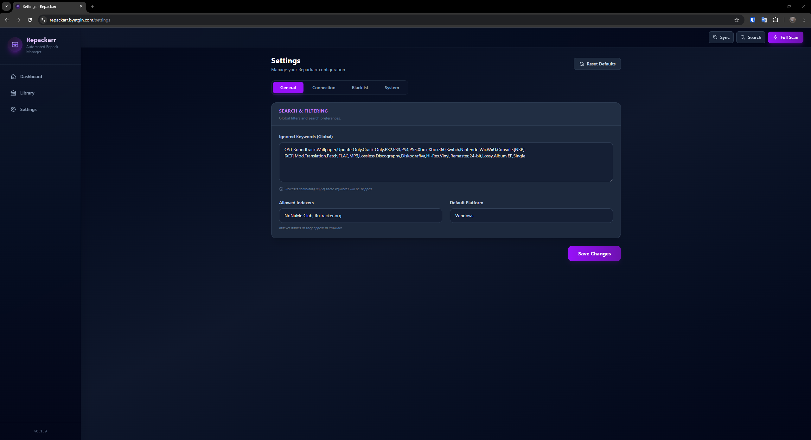

# Repackarr

[](LICENSE)
[](https://ghcr.io/yakrel/repackarr)

**Repackarr** is an automated manager for game repacks. It monitors your existing qBittorrent library, tracks updates through Prowlarr, and allows you to upgrade your games with a single click. Think of it as "Sonarr/Radarr" specifically tailored for the game repack community.

## How It Works

```
1. Sync Library      →   Repackarr imports your games from qBittorrent and detects their current versions.
2. Scan for Updates  →   Prowlarr indexers are searched on a schedule for newer releases of each game.
3. One-Click Update  →   Found a newer version? Send the magnet directly to qBittorrent with a single click.
```

## Screenshots

### Dashboard


### Library


### Settings


## Features

- **Automatic Library Sync**: Imports your existing games from qBittorrent automatically — no manual entry needed.
- **Smart Version Detection**: Accurately reads the current version of each game from torrent titles and tracker pages, including all major repackers (FitGirl, DODI, ElAmigos, KaOs, and more).
- **Scheduled Update Scanning**: Periodically searches your Prowlarr indexers for newer versions of every game in your library.
- **Smart Filtering**: Automatically ignores mods, patches, soundtracks, console releases, and other non-game content so your dashboard stays clean.
- **Game Covers & Metadata**: Displays game artwork and metadata fetched from IGDB, with autocomplete when adding games manually.
- **One-Click Updates**: When a newer version is found, send it straight to qBittorrent with a single click.
- **Flexible Monitoring**: Add a game silently (monitor only future updates) or immediately search for the latest version — your choice.
- **Skip & Ignore**: Not interested in a specific release? Skip it or hide it permanently. Restore it anytime from the Blacklist tab.
- **Scan History**: Every sync and update scan is logged. Review what was found, what was skipped, and why.

## Getting Started (Docker)

### Prerequisites
1. **qBittorrent**: WebUI must be enabled. Games you want to monitor should be in a dedicated category (default: `games`).
2. **Prowlarr**: At least one indexer configured. For the best results, **RuTracker.org** and **NoNaMe Club (NNM-Club)** are recommended.
3. **IGDB** *(Optional but recommended)*: Enables game covers and autocomplete search. Register a free app at the [Twitch Developer Portal](https://dev.twitch.tv/console) to get your credentials.

### 1. Create Directories
```bash
mkdir repackarr && cd repackarr
mkdir data logs
```

### 2. Configure Environment
```bash
cp .env.example .env
# Edit .env with your qBittorrent and Prowlarr details
```

### 3. Docker Compose
```yaml
services:
  repackarr:
    image: ghcr.io/yakrel/repackarr:latest
    container_name: repackarr
    restart: unless-stopped
    ports:
      - "8090:3000"
    env_file: .env
    volumes:
      - ./data:/app/data
      - ./logs:/app/logs
    healthcheck:
      test: ["CMD", "curl", "-f", "http://localhost:3000/health"]
      interval: 30s
      timeout: 10s
      retries: 3
```

### 4. Launch
```bash
docker compose up -d
```
Open `http://your-ip:8090` and hit **Sync Library** to get started.

## Configuration

All connection details are set via environment variables in your `.env` file:

| Variable | Default | Description |
|---|---|---|
| `QBIT_HOST` | — | qBittorrent WebUI URL (e.g. `http://192.168.1.10:8080`) |
| `QBIT_USERNAME` | — | qBittorrent username |
| `QBIT_PASSWORD` | — | qBittorrent password |
| `QBIT_CATEGORY` | `games` | The qBittorrent category to monitor |
| `PROWLARR_URL` | — | Prowlarr URL |
| `PROWLARR_API_KEY` | — | Prowlarr API key |
| `IGDB_CLIENT_ID` | (None) | *Recommended* — enables covers & autocomplete |
| `IGDB_CLIENT_SECRET` | (None) | *Recommended* — enables covers & autocomplete |
| `CRON_INTERVAL_MINUTES` | `360` | How often to scan for updates (in minutes) |
| `AUTH_USERNAME` | (None) | Enable Basic Auth for the UI |
| `AUTH_PASSWORD` | (None) | Enable Basic Auth for the UI |
| `DATA_DIR` | `/app/data` | Where the database is stored |

The following can also be changed directly from the **Settings** page in the UI:
- **Ignored Keywords** — releases containing these keywords will be skipped globally.
- **Allowed Indexers** — restrict searches to specific Prowlarr indexers.
- **Default Platform** — Windows, Linux, or macOS.

## Troubleshooting

- **Games not found**: Try adjusting the "Search Query" for that game in the Library page to match how it appears on your indexer.
- **Indexer not working**: The name in **Allowed Indexers** must match exactly what Prowlarr shows.
- **Database errors on startup**: Fix permissions with `chown -R 1000:1000 ./data`.
- **Reverse proxy**: Works with Nginx Proxy Manager and Traefik using a standard WebSocket-enabled config.

## License

GPL v3 License. See [LICENSE](LICENSE) for more information.

---
*Repackarr is a tool for managing your own library. Please support game developers whenever possible.*
